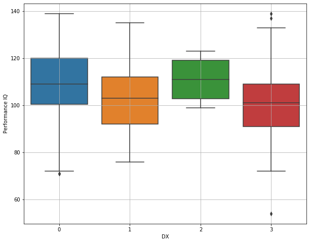
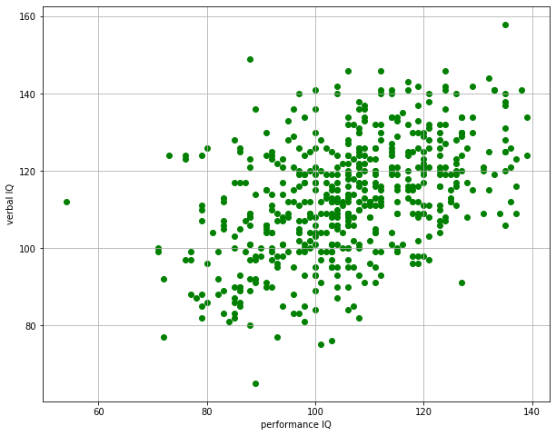
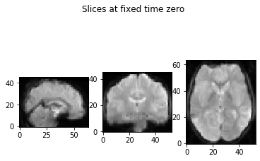
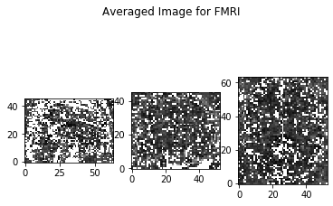
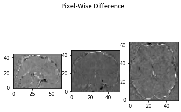
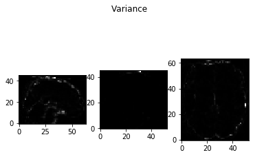
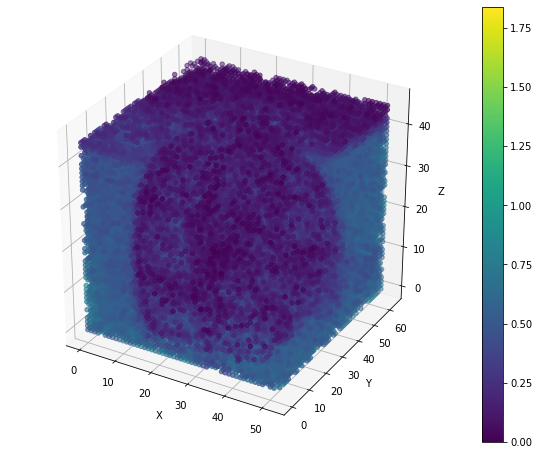
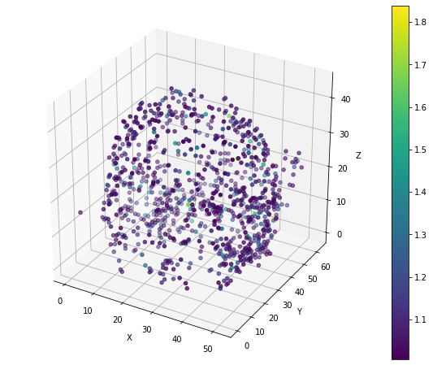

# Comparing Traditional Method with Deep Learning in fMRI Pattern Recognition
## Abstract
Deep Learning achieves huge success in various image processing tasks. It is, there-
fore, a popular candidate for processing fMRI data which encodes rich information
of the neural activity and is hard to be interpreted directly with human eyes. We
explore the performance of deep learning models compared with traditional machine
learning methods on 125 fMRI samples from the ADHD-200 dataset. Concretely, we
compare the results of pixel-wise KL Divergence and Deep Learning models in pat-
tern recognition and localization of the fMRI data. We nd that the pixel-wise KL
Divergence based model consistently outperforms deep learning models in all tasks.
We expect that a larger amount of data and more sophisticated data pre-processing
would help deep learning models in the future.

## Description

The github resiportory documents all codes for the project including implementation of the metrics and preprocessing of the FMRI data. The paper is also attached where one can look at the methods. Read the paper first to know more about it.


## Phenotypic Analysis of the selected data from ADHD-200 dataset







## Visualization of the FMRI data





One can use the notebook FMRI data visualization in the notebook file to animate the FMRI data.

### Traditional Methods Analysis




The first is the KL Divergence of time evolution of all FMRI pixels of type 1 ADHD kids compared with healthy kids 
The second is the top 10000 pixels of the result.




For more information, please look at the KL test notebook and the paper.


### And coding style tests

Explain what these tests test and why

```
Give an example
```

## Deployment

Add additional notes about how to deploy this on a live system

## Built With

* [Dropwizard](http://www.dropwizard.io/1.0.2/docs/) - The web framework used
* [Maven](https://maven.apache.org/) - Dependency Management
* [ROME](https://rometools.github.io/rome/) - Used to generate RSS Feeds

## Contributing

Please read [CONTRIBUTING.md](https://gist.github.com/PurpleBooth/b24679402957c63ec426) for details on our code of conduct, and the process for submitting pull requests to us.

## Versioning

We use [SemVer](http://semver.org/) for versioning. For the versions available, see the [tags on this repository](https://github.com/your/project/tags). 

## Authors

* **Billie Thompson** - *Initial work* - [PurpleBooth](https://github.com/PurpleBooth)

See also the list of [contributors](https://github.com/your/project/contributors) who participated in this project.

## License

This project is licensed under the MIT License - see the [LICENSE.md](LICENSE.md) file for details

## Acknowledgments

* Hat tip to anyone whose code was used
* Inspiration
* etc

